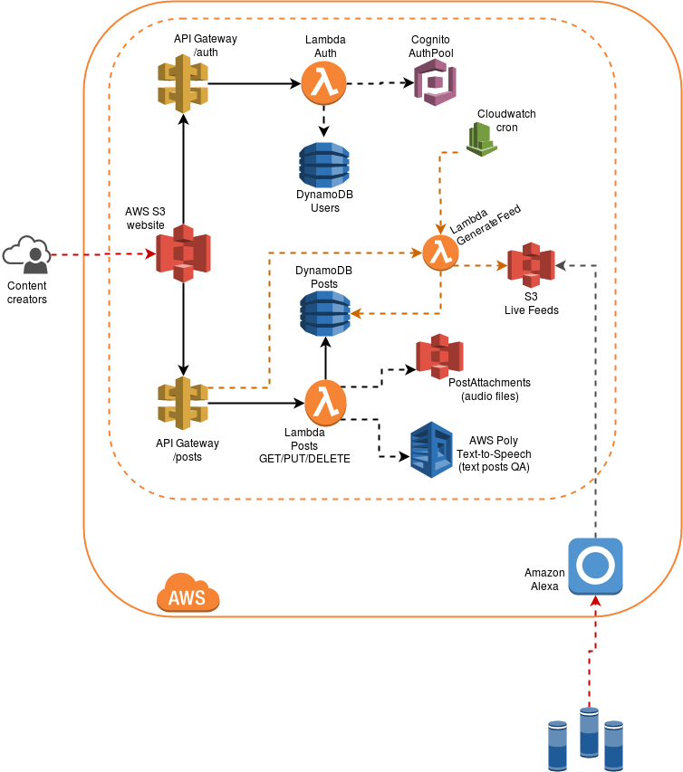

# alexa-flash-briefing

A CMS for Alexa Flash Briefings.

-----

## Inspirations and resources

- https://www.terraform.io/
- https://aws.amazon.com/blogs/machine-learning/build-your-own-text-to-speech-applications-with-amazon-polly/
- https://github.com/aws/amazon-cognito-identity-js
- https://github.com/danilop/LambdAuth
- https://docs.aws.amazon.com/cognito/latest/developerguide/authentication-flow.html
- https://aws.amazon.com/blogs/mobile/customizing-your-user-pool-authentication-flow/
- https://aws.amazon.com/blogs/mobile/integrating-amazon-cognito-user-pools-with-api-gateway/
